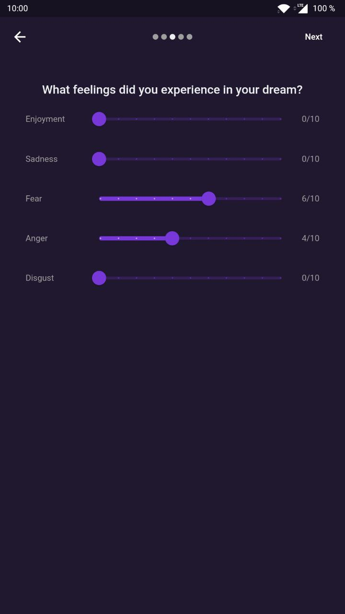

# Dreamer

An opensource Flutter app for tracking dreams.

## Getting Started

### Install

- Install Flutter and android studio
- Generate build files with

  `flutter pub run build_runner build --delete-conflicting-outputs`
- To build apk files

  `flutter build apk --split-per-abi`

### [Download the app from github](docs/dreamer.apk "App")

Google sign in doesn't work since i'm an iranian developer (sanctions).

